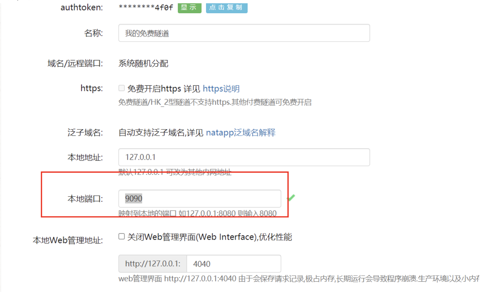

## 使用说明

### 开发前准备
[支付宝官方开发文档](https://opendocs.alipay.com/open/01bxlm)

[支付宝沙箱控制台](https://open.alipay.com/develop/sandbox/app)

在沙箱中，可以查看您的引用APPID、公钥、密钥，也可以自定义密钥以及密钥的加签方式。

同时，也可以创建自己的应用，通过审核后，可以使用应用的接口和网关。

### Springboot集成

maven依赖
```xml
<!--支付宝sdk-->
<dependency>
    <groupId>com.alipay.sdk</groupId>
    <artifactId>alipay-sdk-java</artifactId>
    <version>4.10.170.ALL</version>
</dependency>
```

在application.xml中配置自己的app_id等信息
```yaml
alipay:
  app_id: xxx
  app_private_key: xxx
  alipay_public_key: xxx
  sign_type: RSA2
  charset: utf-8
  gatewayUrl: https://openapi-sandbox.dl.alipaydev.com/gateway.do
  returnUrl: http://xxx.natappfree.cc/alipay/returnUrl    # 需要在https://natapp.cn/做内网穿透后设置，将xxx替换为自己的
  notifyUrl: http://xxx.natappfree.cc/alipay/notifyUrl    # 需要在https://natapp.cn/做内网穿透后设置，将xxx替换为自己的
```

AlipayProperties用于读取配置文件的信息
```java
@Setter
@Getter
@Component
@ConfigurationProperties(prefix = "alipay")
public class AlipayProperties {

    // 商品应用ID
    private String appId;

    // 商户私钥，您的PKCS8格式RSA2私钥
    private String appPrivateKey;

    // 支付宝公钥,查看地址：https://openhome.alipay.com/platform/keyManage.htm 对应APPID下的支付宝公钥。
    private String alipayPublicKey;

    // 签名方式
    private String signType;

    // 字符编码格式
    private String charset;

    // 支付宝网关
    private String gatewayUrl;
}
```
AlipayClient用户配置一个阿里云客户端的bean
```java
@Configuration
public class AliPayConfig {
    @Bean
    public AlipayClient alipayClient(AlipayProperties alipayProperties) {
        return new DefaultAlipayClient(alipayProperties.getGatewayUrl(),
                alipayProperties.getAppId(),
                alipayProperties.getAppPrivateKey(),
                "json",
                alipayProperties.getCharset(),
                alipayProperties.getAlipayPublicKey(),
                alipayProperties.getSignType());
    }
}
```

创建一个接口，用户接收支付的请求
```java
@RestController
@RequestMapping("/alipay")
public class PayController {

    @Autowired
    private AlipayClient alipayClient;

    @Autowired
    private AlipayProperties alipayProperties;

    @Value("${alipay.notifyUrl}")
    private String notifyUrl;

    @Value("${alipay.returnUrl}")
    private String returnUrl;

    @RequestMapping(value = "/pay", method = RequestMethod.GET)
    // http://localhost:9090/alipay/pay?subject=支付&totalAmount=1000
    public String pay(AliPayDTO aliPayDTO) throws AlipayApiException {
        // 随机一个订单id
        Random random = new Random();
        int tradeNo = random.nextInt(1000000);
        // 设置请求参数
        AlipayTradePagePayRequest alipayRequest = new AlipayTradePagePayRequest();
        // 同步回调地址
        alipayRequest.setReturnUrl(returnUrl);
        // 异步回调地址
        alipayRequest.setNotifyUrl(notifyUrl);
        // 订单过期时间
        LocalDateTime now = LocalDateTime.now();
        LocalDateTime plusOneMinute = now.plusMinutes(1L);
        DateTimeFormatter formatter = DateTimeFormatter.ofPattern("yyyy-MM-dd HH:mm:ss");
        String expireTime = plusOneMinute.format(formatter);
        // 设置请求转发的参数
        alipayRequest.setBizContent("{\"out_trade_no\":\"" + tradeNo + "\","
                + "\"total_amount\":\"" + aliPayDTO.getTotalAmount() + "\","
                + "\"subject\":\"" + aliPayDTO.getSubject() + "\","
                + "\"body\":\"" + aliPayDTO.getBody() + "\","
                + "\"product_code\":\"FAST_INSTANT_TRADE_PAY\","
                + "\"timeout_express\":\"1m\","                 // 设置订单过期时间为1分钟
                + "\"time_expire\":\"" + expireTime + "\"}");   // 设置订单过期时间
        return alipayClient.pageExecute(alipayRequest).getBody();
    }
}
```

AlipayDTO是前端请求的请求体，最好用POST请求，这里演示方便使用GET请求
```java
@Data
public class AliPayDTO {

    // 订单编号
    private String traceNo;

    // 付款金额，必填
    private double totalAmount;

    // 订单名称，必填
    private String subject;

    // 商品描述，可空
    private String body;

    private String alipayTraceNo;
}
```

启动Spring容器，请求接口：```http://localhost:9090/alipay/pay?subject=支付&totalAmount=1000```


使用沙箱账号登录，支付就可以。

### 设置内网穿透回调
[设置内网穿透](https://natapp.cn/)

配置免费的隧道，端口：9090：



[netapp使用文档](https://natapp.cn/article/natapp_newbie)

启动成功后，在控制台查看属于自己的地址，将application.yml中的returnUrl和notifyUrl中的xxx替换

### 回调接口

创建一个POST接口，用户回调支付成功的函数
```
@PostMapping("/notifyUrl")  // 注意这里必须是POST接口
public String payNotify(HttpServletRequest request) {
    if (request.getParameter("trade_status").equals("TRADE_SUCCESS")) {
        System.out.println("=========支付宝异步回调========");

        Map<String, String> params = new HashMap<>();
        Map<String, String[]> requestParams = request.getParameterMap();
        for (String name : requestParams.keySet()) {
            params.put(name, request.getParameter(name));
        }
        System.out.println("交易名称: " + params.get("subject"));
        System.out.println("交易状态: " + params.get("trade_status"));
        System.out.println("支付宝交易凭证号: " + params.get("trade_no"));
        System.out.println("商户订单号: " + params.get("out_trade_no"));
        System.out.println("交易金额: " + params.get("total_amount"));
        System.out.println("买家在支付宝唯一id: " + params.get("buyer_id"));
        System.out.println("买家付款时间: " + params.get("gmt_payment"));
        System.out.println("买家付款金额: " + params.get("buyer_pay_amount"));
    }
    return "success";
}
```
